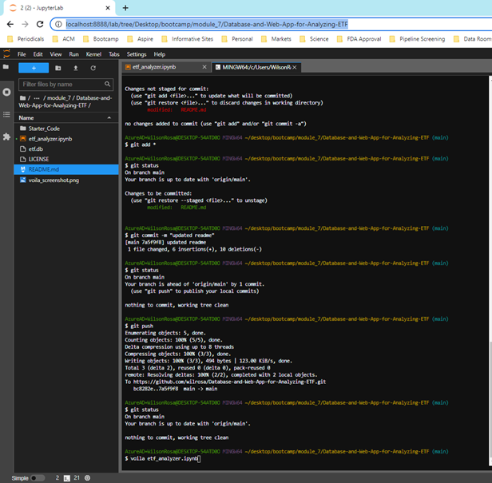
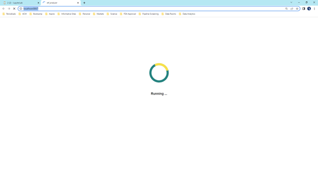
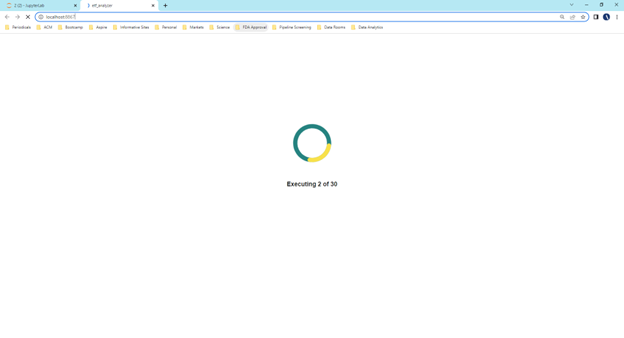
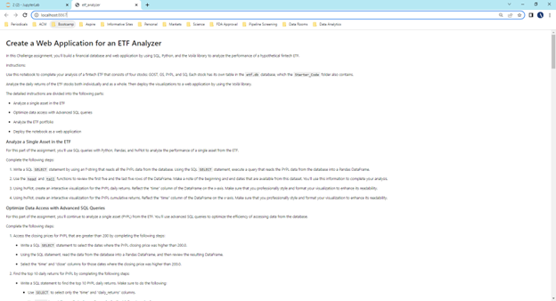
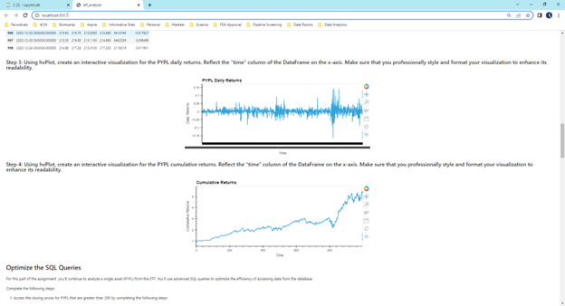

# Database-and-Web-App-for-Analyzing-ETF

This repo contains the results of the module 7 challenge. To view the file, open the "etf_analyzer.ipynb" file. 

In this module, I built a financial database and web application by using SQL, Python, and the Voilà library to analyze the performance of a hypothetical fintech ETF. To do so, I created the following a Jupyter notebook that contains the following: (1) an analysis of the ETF data that a SQL database stores, (2) professionally styled and formatted interactive visualizations, and (3) a web application created by deploying a Jupyter notebook via the Voilà library.

The `etf_analyzer.ipynb` notebook contains the analysis of a fintech ETF that consists of four stocks: GOST, GS, PYPL, and SQ. Each stock has its own table in the etf.db database. I analyzed the daily returns of the ETF stocks both individually and as a whole. Then deployed the visualizations to a web application by using the Voilà library. Specifically, I (1) analyzed a single asset in the ETF, (2) optimized the data access with advanced SQL queries, (3) analyzed the ETF portfolio, and (4) deploy the notebook as a web application.

## Installation Guide

First, voila was installed into the development environment.

```python
pip install voila
```
---

## Technologies

This project leverages python 3.7 with the following libraries and dependencies:

* [pandas](https://github.com/pandas-dev/pandas) - For manipulating data

* [hvplot](https://github.com/holoviz/hvplot) - High-level plotting API for the PyData ecosystem built on HoloViews

* [numpy](https://github.com/numpy) - Fundamental package for scientific computing with Python

* [sqlalchemy](https://github.com/sqlalchemy/sqlalchemy) - Python SQL toolkit and Object Relational Mapper

---

### **Analyze a Single Asset in the ETF**

For this part of the assignment, I used SQL queries with Python, Pandas, and hvPlot to analyze the performance of a single asset from the ETF. To do so, I completed the following steps: 

(1) Wrote a SQL `SELECT` statement by using an f-string that reads all the PYPL data from the database. Using the SQL `SELECT` statement, executed a query that reads the PYPL data from the database into a Pandas DataFrame.

(2) Used the `head` and `tail` functions to review the first five and the last five rows of the DataFrame. Made a note of the beginning and end dates that are available from the dataset.

(3) Using hvPlot, created an interactive visualization for the PYPL daily returns. Reflected the “time” column of the DataFrame on the x-axis. Professionally styled and formated the visualization to enhance readability.

(4) Using hvPlot, created an interactive visualization for the PYPL cumulative returns applying the same methodology as in step (3).

### **Optimize Data Access with Advanced SQL Queries**

Here, I continued to analyze PYPL from the ETF. I used advanced SQL queries to optimize the efficiency of accessing data from the database.

(1) Accessed the closing prices for PYPL that are greater than 200 by completing the following steps:

    (a) Wrote a SQL SELECT statement to select the dates where the PYPL closing price were higher than 200.0.
    
    (b) Using the SQL statement, read the data from the database into a Pandas DataFrame.
    
    (c) Selected the “time” and “close” columns for those dates where the closing price was higher than 200.0.

(2) Wrote a SQL statement to find the top 10 daily returns for PYPL by completing the following steps:

    (a) Used `SELECT` to select only the “time” and “daily_returns” columns.
    
    (b) Used `ORDER` to sort the results in descending order by the “daily_returns” column.
    
    (c) Used `LIMIT` to limit the results to the top 10 daily return values.

    (d) Using the SQL statement, read the data from the database into a Pandas DataFrame.

### **Analyze the ETF Portfolio**

In this section, I built the entire ETF portfolio and then evaluated its performance. To do so, I used SQL joins to combine all the data for each asset by completing the following steps:

(1) Wrote a SQL query to join each table in the portfolio into a single DataFrame by doing the following:

    (a) Used a SQL inner join to join each table on the “time” column. Accessed the “time” column in the `GDOT` table via the `GDOT.time` syntax. Accessed the “time” columns from the other tables via similar syntax.
    
    (b) Using the SQL query, read the data from the database into a Pandas DataFrame.
    
(2) Created a DataFrame that averages the “daily_returns” columns for all four assets.

(3) Used the average daily returns in the `etf_portfolio_returns` DataFrame to calculate the annualized returns for the portfolio. Displayed the annualized return value of the ETF portfolio.

(4) Used the average daily returns in the `etf_portfolio_returns` DataFrame to calculate the cumulative returns of the ETF portfolio.

(5) Using hvPlot, created an interactive line plot that visualized the cumulative return values of the ETF portfolio. Reflected the “time” column of the DataFrame on the x-axis. Professionally styled and formatted the visualization to enhance its readability.

### **Deploy the Notebook as a Web Application**

Finally, I used the Voilà library to deploy the notebook as a web application, as demonstrated by the following screen shot:











---
## Contributors

Brought to you by Wilson Rosa. https://www.linkedin.com/in/wilson-rosa-angeles/.

---
## License

MIT